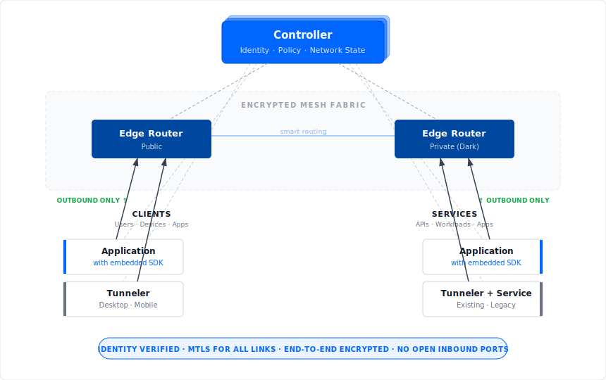

<!-- markdownlint-disable MD033 -->

[](https://github.com/openziti/ziti/actions/workflows/main.yml?query=branch%3Arelease-next)
[](https://goreportcard.com/report/github.com/openziti/ziti)
[](https://pkg.go.dev/github.com/openziti/ziti)
[](https://openziti.discourse.group/)
[](https://github.com/openziti/ziti/blob/main/LICENSE)
[](https://github.com/openziti/ziti)

# OpenZiti

OpenZiti is an open-source zero-trust networking platform that makes network services invisible to unauthorized users. Every connection, whether from a user, a service, a device, or a workload, is authenticated with cryptographic identity, authorized by policy, and encrypted end-to-end.

OpenZiti works with both existing applications (using lightweight tunnelers with no code changes required) and new applications (using embedded SDKs for the strongest zero-trust model). This makes it practical for both brownfield environments and greenfield development.

Created and sponsored by [NetFoundry](https://netfoundry.io). Licensed under [Apache 2.0](LICENSE).

<p align="center">
  
</p>

---

## Table of Contents

- [Use Cases](#use-cases)
- [Key Capabilities](#key-capabilities)
- [Three Deployment Models](#three-deployment-models)
- [Getting Started](#getting-started)
- [Architecture](#architecture)
- [Zero Trust, Dark Services, and End-to-End Encryption](#zero-trust-dark-services-and-end-to-end-encryption)
- [SDKs](#sdks)
- [Community & Support](#community--support)
- [Contributing](#contributing)
- [Adopters](#adopters)
- [Managed Solution](#managed-solution)

---

## Use Cases

OpenZiti enables you to extend zero-trust anywhere for any use case, including non-human workloads and workflows, across multiple networks and third parties.  The following are some common use cases.

### Replace VPNs

Provide secure access to internal services without VPN clients, split tunneling headaches, or concentrator bottlenecks. Each service is individually authorized. No "once you're in, you can reach everything" problem.

### Dark APIs and Services

Make APIs and services invisible to the internet. Zero listening ports means zero attack surface. Authorized clients connect through OpenZiti; everyone else sees nothing.

### IoT and Non-Human Identity

Give every device, sensor, and machine a unique cryptographic identity. OpenZiti's identity model works for non-human workloads just as well as human users, providing strong authentication for the machine-to-machine connections that make up the majority of modern network traffic.

### Zero Trust Workloads

Secure workload-to-workload communication across clouds and environments. Services authenticate each other with cryptographic identity, not network location. No shared secrets, no IP allowlists, no ambient authority.

### Multi-Cloud and Hybrid Connectivity

One overlay network across AWS, Azure, GCP, on-prem data centers, and edge locations. No cloud-specific networking tools, no VPN tunnels between environments, no complex peering arrangements.

### Self-Hosted Service Access

Access home lab or self-hosted services like Nextcloud, Home Assistant, media servers, and development environments from anywhere. No open router ports, no dynamic DNS, no reliance on third-party tunnel services. You control the entire path.

### Kubernetes and Cross-Cluster Services

Connect services across Kubernetes clusters without complex ingress rules, service mesh sidecars, or VPN tunnels between clusters. Works beyond Kubernetes, supporting connecting k8s services to VMs, bare metal, IoT devices, or anything else on the overlay.

### Agentic AI

Private and secure connectivity to MCP Servers and private LLMs.

---

## Key Capabilities

| Capability | Description |
|---|---|
| **Dark Services** | Services have zero listening ports. Invisible to scanners and unauthorized users. |
| **Identity for Everything** | Cryptographic identity for users, services, devices, and non-human workloads (NHI). Not IP-based. |
| **Identity-Based Operations** | Manage networks through identities and policies instead of IP addresses and firewall rules. Simplifies operations and eliminates manual network configuration. |
| **End-to-End Encryption** | Data encrypted from source to destination using libsodium. mTLS for authentication. Zero trust in the network path. |
| **No VPNs or Open Ports** | Connections route through OpenZiti's overlay. No VPN clients, no inbound firewall rules, no exposed ports. |
| **Smart Routing** | Mesh fabric with intelligent path selection for performance and reliability. |
| **Flexible Deployment** | Embed SDKs, use tunnelers, or deploy at the network level. Mix and match per service. |
| **Policy-Driven Access** | Fine-grained, identity-based policies. Access can be revoked in real time, closing active connections. |
| **Programmable REST APIs** | Full management API for automation and integration. Web-based admin console included. |
| **Fully Self-Hostable** | Run the entire platform on your infrastructure. No vendor dependencies. Open source, Apache 2.0. |

---

## Three Deployment Models

OpenZiti supports three zero-trust models. Mix them in a single network and migrate between them over time.

### Network Access

Deploy an OpenZiti edge router in a trusted network zone. Traffic enters the overlay from authenticated clients and exits into the private network where services run.

- **Code changes:** None
- **Agent on service host:** None
- **Security model:** Identity-based access at the network boundary. Similar to a gateway, but with cryptographic identity and encrypted transport.

### Host Access

Run an OpenZiti tunneler on the same host as your service. The tunneler handles identity, authentication, and encryption. The service only needs to accept connections from localhost.

- **Code changes:** None
- **Setup:** Install tunneler, enroll identity
- **Security model:** Trust boundary at the host OS. Service is dark to the network and only reachable through the tunneler.

### Application Access (Strongest)

Embed an OpenZiti SDK directly in client and/or server applications. The application itself holds the cryptographic identity and encrypts traffic in-process. No listening ports exist, not even on localhost.

- **Code changes:** Yes
- **Security model:** Strongest. End-to-end encryption in-process. Fully dark. Identity at the application layer, not the network, not the host.

> **Where to start:** Many teams begin with **Host Access** (tunnelers) for existing services. It deploys in minutes with no code changes. For new development or high-security workloads, **Application Access** (SDKs) provides the strongest zero-trust posture.

---

## Getting Started

The following Quick Starts show how to set up a local OpenZiti network for development, testing, and learning.  For production deployments, see the product documentation at https://netfoundry.io/docs/openziti/category/deployments/.

### Quick Start with Docker

The fastest way to get a local OpenZiti network running:

```bash
wget https://get.openziti.io/dock/all-in-one/compose.yml
docker compose up
```

This starts a controller, edge router, and the Ziti console in a single compose stack. The console is available at `https://localhost:1280/zac/`. From here you can create identities, define services, and configure access policies.

See the [all-in-one Docker quickstart](./quickstart/docker/all-in-one) for full details including storage options, environment variables, and CLI usage.

### Quick Start with the CLI

Download the latest `ziti` binary from [GitHub Releases](https://github.com/openziti/ziti/releases/latest), then:

```bash
ziti edge quickstart
```

This brings up a local development network: controller, router, and a default admin identity. Ideal for testing and learning.

### Learn More

| Resource | Description |
|---|---|
| [Introduction](https://netfoundry.io/docs/openziti/learn/introduction/) | Core concepts and how OpenZiti works |
| [Quickstart Guides](https://netfoundry.io/docs/openziti/learn/quickstarts/) | Step-by-step setup for local, Docker, and hosted environments |
| [Zero Trust Models](https://netfoundry.io/docs/openziti/learn/core-concepts/zero-trust-models/overview/) | Deep dive into the three deployment models |
| [Tunneler Reference](https://netfoundry.io/docs/openziti/reference/tunnelers/) | Get started with zero code changes |

---

## Architecture

OpenZiti's overlay network runs on top of existing infrastructure: any IP network, any cloud, any combination. The core components:

### Controller

The controller is the management plane. It handles:

- **Identity management**: issues and verifies cryptographic identities (x509 certificates) for every participant in the network
- **Policy enforcement**: defines which identities can access which services, through which edge routers
- **Network state**: tracks routers, services, and topology; provides a REST API and web-based admin console for management

### Edge Routers

Edge routers form the data plane, a mesh fabric that carries encrypted traffic between endpoints.

- **Public routers** are reachable from the internet, serving as entry points to the network
- **Private ("dark") routers** are deployed inside private networks with only outbound connections

Routers automatically discover each other, form mesh connections, and use smart routing to select the best path based on latency, throughput, and cost.

### Endpoints: SDKs and Tunnelers

Endpoints are how applications and users connect to the OpenZiti network:

- **SDKs** (Go, C, Python, Node.js, Java, Swift, C#): embed zero trust directly in your application. The app itself holds the identity and handles encryption. No sidecar, no agent, no listening ports.

- **Tunnelers** (Linux, Windows, macOS, iOS, Android): lightweight apps that provide OpenZiti connectivity to unmodified software. Traffic is intercepted and routed through the overlay transparently. No code changes required.

---

## Zero Trust, Dark Services, and End-to-End Encryption

### Zero Trust and Application Segmentation

Every participant (e.g., user, service, device, workload) in an OpenZiti network carries a unique cryptographic identity backed by x509 certificates. When a connection is attempted, OpenZiti verifies:

1. The identity is valid and enrolled
2. A policy exists granting that identity access to the requested service
3. The connection is through an authorized edge router

If any check fails, the connection is denied. If access is later revoked, active connections are terminated immediately. There is no implicit trust based on network location. Being on the same LAN grants no more access than being across the internet, unless policy explicitly allows it.

This model provides zero trust application segmentation: each service is independently authorized. Gaining access to one service does not grant access to any other.

### Dark Services

A "dark" service has no open ports. It doesn't listen on any network interface for incoming connections. Instead, the service (or a tunneler alongside it) makes an **outbound** connection to an OpenZiti edge router and registers itself. Clients reach it only through the OpenZiti fabric, after authentication and authorization.

What this means in practice:

- **Port scans find nothing**: there are no listening ports to discover
- **No attack surface**: you can't exploit what you can't reach
- **DDoS resistance**: there is no public endpoint to flood
- **Invisible to unauthorized users**: only identities with matching policy even know the service exists
- **NAT and firewall friendly**: all connections are outbound, so CG-NAT, double-NAT, and restrictive firewalls are not a concern

Edge routers can also be dark. Private routers make only outbound connections, so no inbound firewall rules are needed in your private network.

### End-to-End Encryption

With OpenZiti SDKs, traffic is encrypted from the sending application to the receiving application using libsodium for the data path and mTLS for identity authentication. Even if routers or intermediate networks are compromised, traffic cannot be decrypted or tampered with.

With tunnelers, encryption covers the path from tunneler to tunneler (or tunneler to SDK), providing machine-to-machine encryption without application changes.

---

## SDKs

Embed zero-trust networking directly in your applications:

| Language | Repository | Notes |
|---|---|---|
| Go | [sdk-golang](https://github.com/openziti/sdk-golang) | Used by the OpenZiti project itself |
| C | [ziti-sdk-c](https://github.com/openziti/ziti-sdk-c) | Ideal for embedded systems, IoT, and high-performance use cases |
| Java / Kotlin | [ziti-sdk-jvm](https://github.com/openziti/ziti-sdk-jvm) | Includes Android support |
| Swift | [ziti-sdk-swift](https://github.com/openziti/ziti-sdk-swift) | iOS and macOS |
| Node.js | [ziti-sdk-nodejs](https://github.com/openziti/ziti-sdk-nodejs) | |
| C# / .NET | [ziti-sdk-csharp](https://github.com/openziti/ziti-sdk-csharp) | |
| Python | [ziti-sdk-py](https://github.com/openziti/ziti-sdk-py) | |

All SDKs are listed under the [OpenZiti GitHub organization](https://github.com/openziti).

---

## Community & Support

OpenZiti has an active and growing community:

- **[Discourse Forum](https://openziti.discourse.group/)**: Ask questions, share projects, get help from the community and maintainers
- **[YouTube](https://www.youtube.com/@OpenZiti)**: Tutorials, demos, and deep dives
- **[Blog](https://blog.openziti.io)**: Project updates and technical articles
- **[Twitter/X](https://twitter.com/openziti)**: News and announcements

---

## Contributing

The OpenZiti project welcomes contributions including code, documentation, bug reports, and feedback.

### Key Repositories

| Repository | Description |
|---|---|
| [openziti/ziti](https://github.com/openziti/ziti) | Core platform: controller, routers, CLI |
| [sdk-golang](https://github.com/openziti/sdk-golang) | Go SDK |
| [ziti-sdk-c](https://github.com/openziti/ziti-sdk-c) | C SDK |
| [ziti-sdk-jvm](https://github.com/openziti/ziti-sdk-jvm) | Java / Kotlin / Android SDK |
| [ziti-sdk-swift](https://github.com/openziti/ziti-sdk-swift) | Swift / iOS SDK |
| [ziti-sdk-nodejs](https://github.com/openziti/ziti-sdk-nodejs) | Node.js SDK |
| [ziti-sdk-csharp](https://github.com/openziti/ziti-sdk-csharp) | C# SDK |
| [ziti-sdk-py](https://github.com/openziti/ziti-sdk-py) | Python SDK |
| [ziti-tunnel-sdk-c](https://github.com/openziti/ziti-tunnel-sdk-c) | Linux tunneler and core tunneler SDK |
| [ziti-tunnel-apple](https://github.com/openziti/ziti-tunnel-apple) | macOS and iOS edge clients |
| [desktop-edge-win](https://github.com/openziti/desktop-edge-win) | Windows desktop edge client |
| [ziti-doc](https://github.com/openziti/ziti-doc) | Documentation site |

### Building from Source

See the [local development tutorial](./doc/002-local-dev.md) for build instructions.

### Developer Documentation

- [Developer Overview](./doc/001-overview.md)
- [Local Development](./doc/002-local-dev.md)
- [Local Deployment](./doc/003-local-deploy.md)
- [Controller PKI](./doc/004-controller-pki.md)
- [Release Notes](./CHANGELOG.md)

---

## Adopters

See who's using OpenZiti: **[ADOPTERS.md](./ADOPTERS.md)**

Using OpenZiti in your project or organization? We'd love to add you. Open an issue or submit a PR.

---

## Managed Solution

For zero-trust networking without managing your own infrastructure, [NetFoundry](https://netfoundry.io/docs/openziti/#deploy_an_overlay) provides a fully managed, globally distributed OpenZiti network as a service, with SLAs, enterprise support, and a global fabric of edge routers.

---

*OpenZiti is developed and open-sourced by [NetFoundry, Inc](https://netfoundry.io).*
