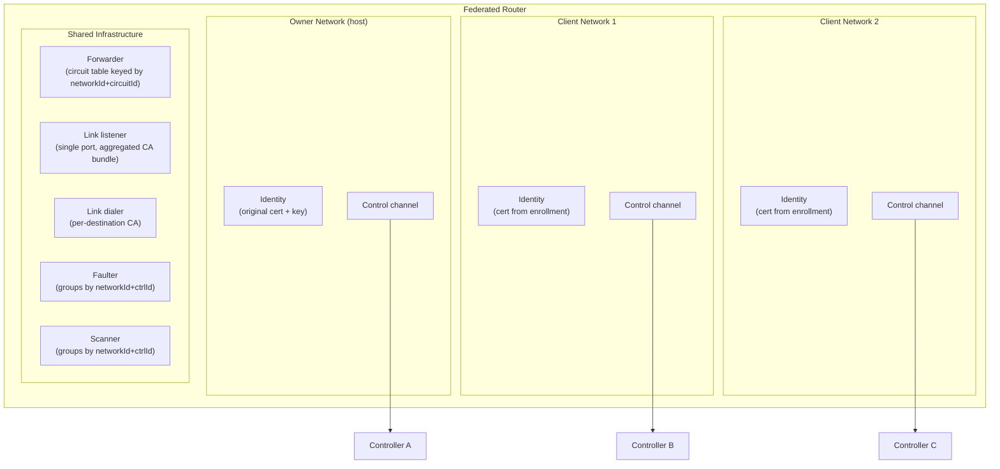
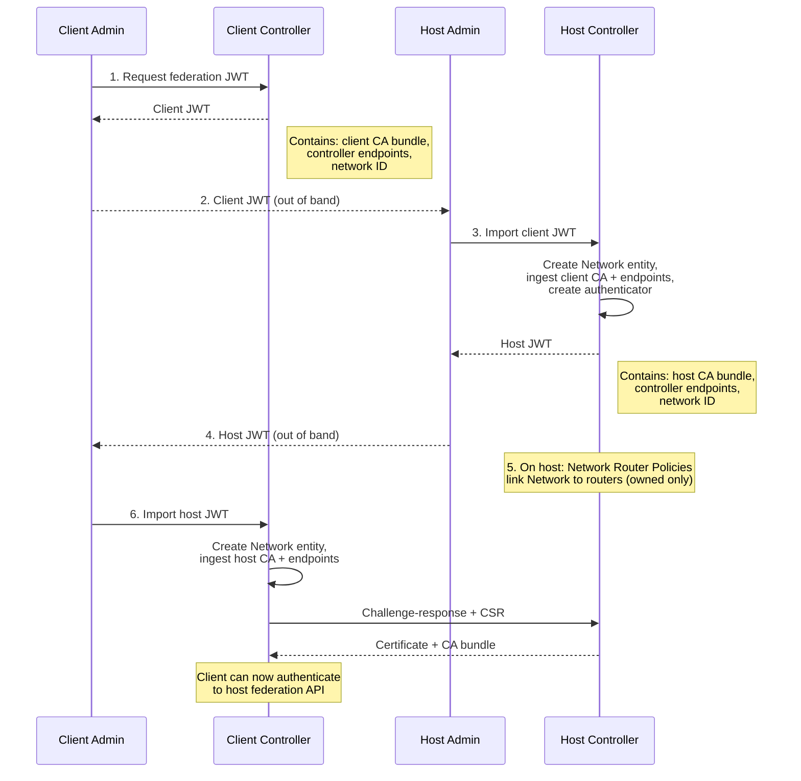
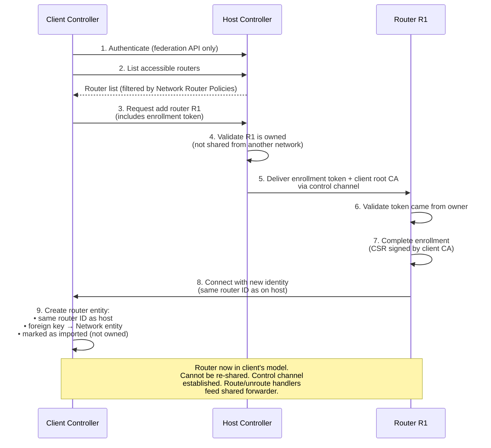
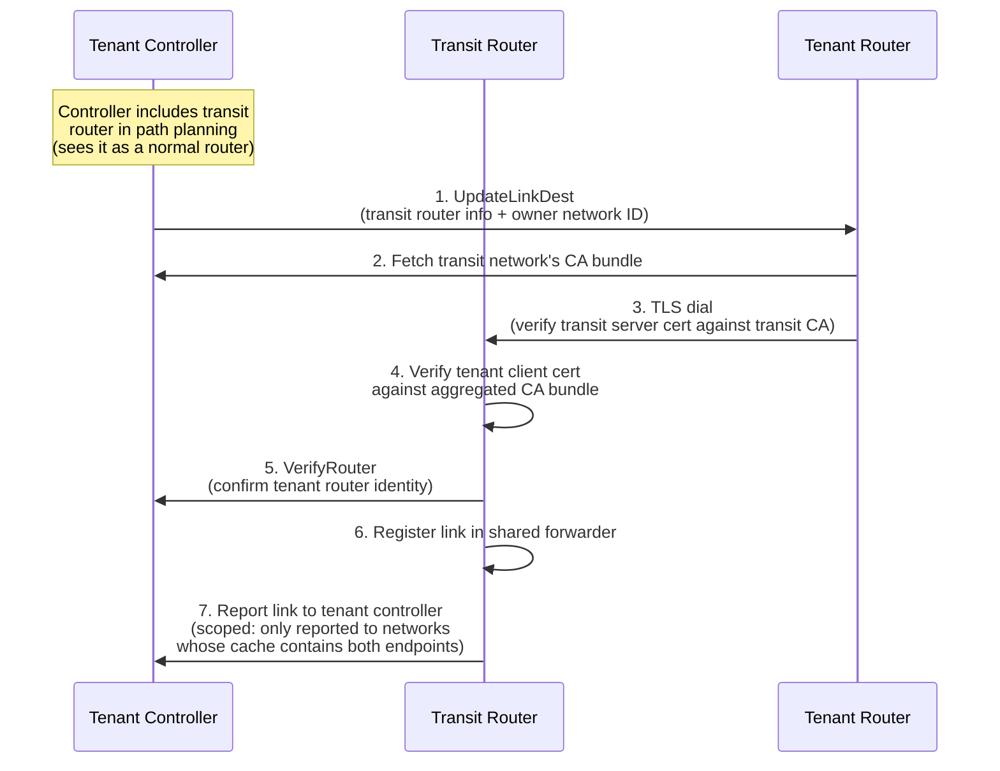

# Network Federation — Summary

For full details, open items, and decision log, see [federation.md](federation.md).

## What Are We Trying to Do?

We want independent Ziti networks to share routers without merging their control planes.
The main use case is multi-tenant transit: a hosting provider runs shared transit
routers, and 50–500 tenant networks use them to bridge their private infrastructure.
The same mechanism supports network federation (two networks sharing routers for
cross-network circuits) and hierarchical topologies.

**Key principles:**

- Each network keeps its own controller, PKI, and policies.
- Shared routers are transit-only — no edge/SDK functionality. We may expand later.
- For routing, controllers see shared routers as normal routers. They may know a router
  is federated, but that only matters for lifecycle operations (creation, deletion,
  re-sharing enforcement).
- Only a router's owning network can share it. No re-sharing.
- We use purpose-built Network and Network Router Policy entities — not overloaded
  identity or edge router policy types.

**Why not a separate appliance?** We considered it. Architecturally cleaner, but it
introduces a lot of operational overhead (trust relationships, separate PKI, DNS, where
does the CLI live?). The integrated approach avoids all of that. And if service-level
federation gets built on top of router sharing — which is likely — keeping the install
simple matters even more.

---

## Router Changes for Multi-Network Support

The forwarder's data plane is already decoupled from router identity. The forwarding
hot path (circuit table → forward table → destination → send) never references a router
identity, and the faulter and scanner already group work by controller. Most of the
forwarder works as-is.

The main addition is the 16-bit network identifier, needed to disambiguate both circuit
IDs and controller IDs across networks. The real work is in how the router manages
identities, control channels, and links across multiple networks.

### Multiple Control Planes

A federated router has one control channel per network. Each has its own identity
(cert + key from enrollment) and its own route/unroute handlers, all feeding into the
shared forwarder.

A `MultiNetworkControllers` wrapper dispatches across all per-network controller sets.
`GetChannel(networkId, ctrlId)` resolves any controller regardless of network.

### Network-Prefixed Circuit Isolation

Each client network gets a 16-bit network identifier from the host controller. It's
injected into payload headers, making the circuit table key `(networkId, circuitId)`
instead of just `circuitId`.

This gives us a structural guarantee of cross-tenant isolation — even a duplicate
circuit ID can't cross the network boundary.

The identifier is also required for controller dispatch. Controller IDs aren't unique
across independent networks — two clients could have controllers with the same ID. The
faulter, scanner, and channel lookups all use `(networkId, ctrlId)` as the composite
key.

16 bits = 65,536 client networks per host. Well above the 50–500 target. Also gives us
cheap per-network identification for metrics and future rate limiting.

### Owner Awareness

The router tracks its owner — the network it was originally provisioned into.
Federation enrollment tokens are only accepted from the owner's control channel. This
prevents re-sharing.

### Link Listener — Aggregated CA Bundle

One port. The TLS config includes CAs from every enrolled network. Client certs are
verified during the TLS handshake — no post-TLS validation needed.

When a network is added or removed, the identity framework updates the trust roots at
runtime. After TLS, the router reads link headers to find the remote router's network
and calls `VerifyRouter` on that controller before registering the link.

### Link Dialer — Per-Destination CA

`UpdateLinkDest` includes the destination's owner network ID. The dialing router
fetches and caches that network's CA bundle, then uses it to verify the server cert.

### Scoped Link Reporting

Each controller only learns about links relevant to its network. The router caches
known router IDs from `UpdateLinkDest` messages and reports each link only to networks
whose cache contains the remote router.

This handles a nice edge case: if a link already exists and a new network later enrolls
both endpoints, it learns about the link without re-establishing it.

### Runtime Add/Remove

Adding a client network: complete enrollment, spin up a control channel. No restart.
The CA bundle updates automatically. Removing: tear down the control channel, drain
circuits, remove the CA.

---

## Provisioning with the OpenZiti Controller

The controller gets two new model entities — **Network** (represents a federation peer)
and **Network Router Policy** (links Networks to routers) — plus a **federation API**
restricted to Network logins.

### Phase 1: Establish Federation

We establish the relationship through a bidirectional JWT exchange. Each JWT carries
the network's CA bundle, controller endpoints, and network ID.

Both sides end up with a Network entity. The host side links it to an authenticator and
Network Router Policies. The client side stores credentials and endpoints.

**JWT signing and authentication** are still under consideration — either a network-wide
cert (shared across controllers) or per-host certs via enrollment/CSR. See the detailed
design doc for tradeoffs.

### Phase 2: Share Routers

The client authenticates to the host's federation API and requests routers.

**Auto-sync mode**: Most deployments won't want to add routers one at a time. In
auto-sync mode, the client subscribes to the host's router list and automatically
enrolls routers as they appear in the Network Router Policy (and removes them when they
disappear). An **attribute template** on the client-side Network entity maps host-side
router attributes to client-side attributes, so imported routers match existing policies
from the start — no manual tagging needed.

### Phase 3: Link Establishment

Once routers are enrolled in multiple networks, links form. Each controller drives link
formation independently.

### No-Re-Sharing Enforcement

Three levels:

1. **Host controller**: Network Router Policies only allow owned routers. Ownership is
   validated before delivering enrollment tokens.
2. **Router**: Only accepts federation enrollment tokens from its owner controller.
3. **Client controller**: Imported routers have a foreign key to the Network entity,
   marking them as imported. Ineligible for the client's own Network Router Policies.
