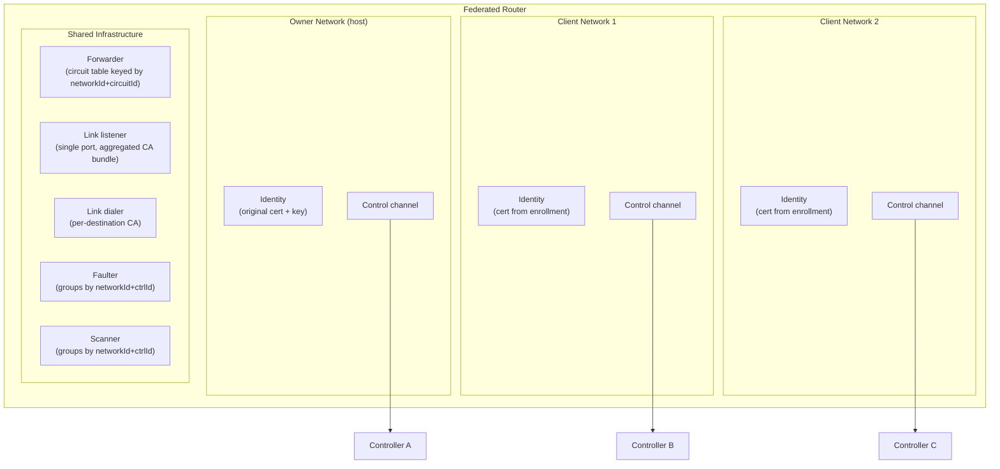
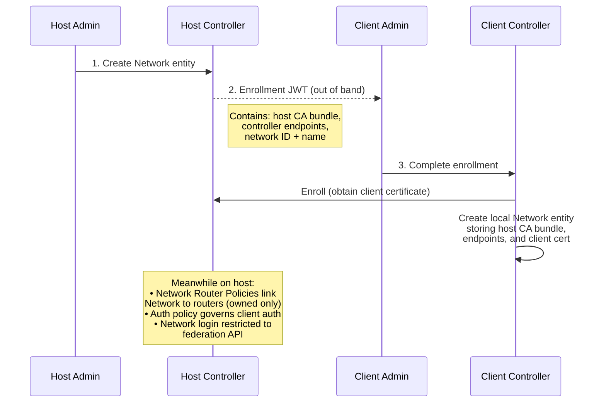
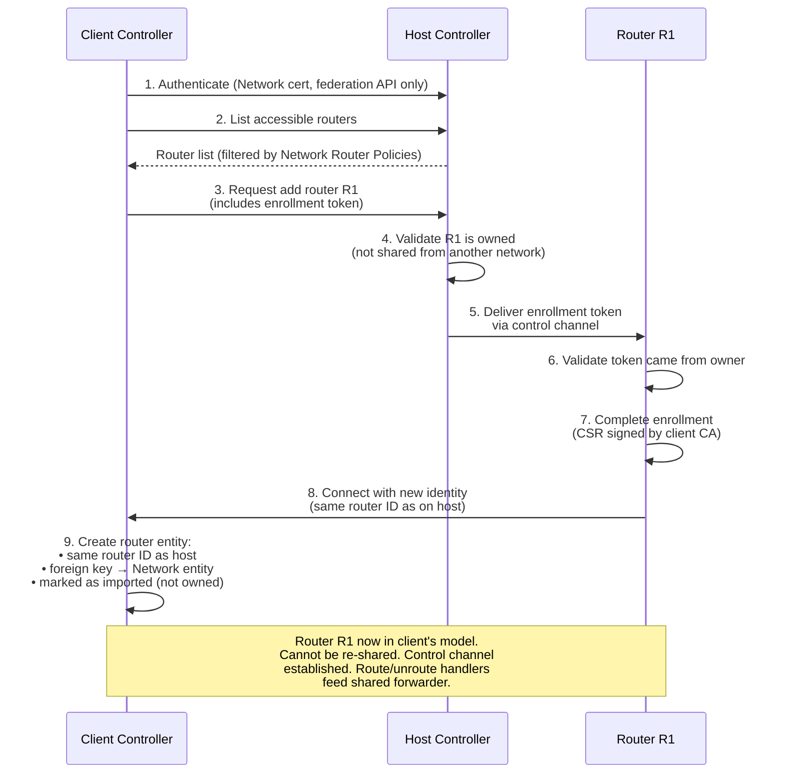
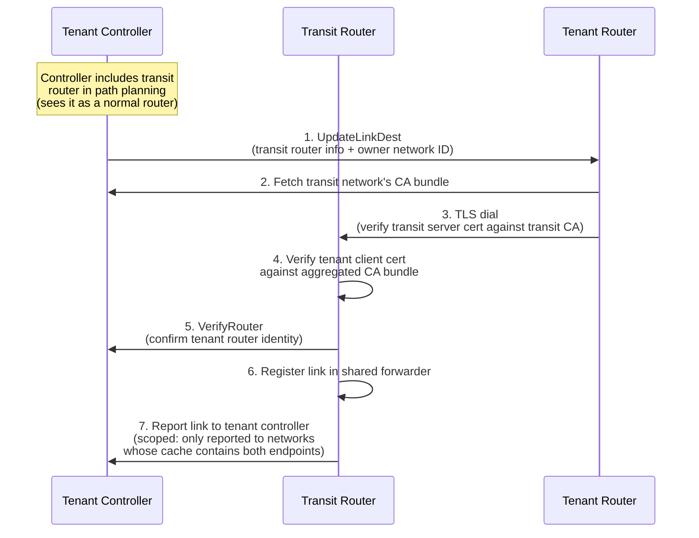

# Network Federation — Summary

This document summarizes the federation design. For full details, open items, and
decision log, see [federation.md](federation.md).

## Design Goals

**Primary goal**: Allow independent Ziti networks to share routers without merging their
control planes. A single router process can serve many networks simultaneously by
forwarding traffic for all of them through its shared forwarder.

**Target use cases**:

- **Multi-tenant transit** — A hosting provider runs public transit routers. Tenant
  networks (50–500 per host) use these routers to bridge their private networks.
- **Network federation** — Two independent Ziti networks share routers to enable
  cross-network circuits.
- **Hierarchical topologies** — Regional transit networks connecting local networks.

**Principles**:

- Each network keeps its own controller, PKI, and policies.
- Shared routers are transit-only — no edge/SDK functionality.
- For routing purposes, controllers see shared routers as normal routers — no special handling in path selection or circuit building. Controllers may be aware that a router is federated, but that only matters for lifecycle operations (creation, deletion, re-sharing enforcement).
- Only a router's owning network can share it. Client networks cannot re-share routers.
- Federation uses purpose-built Network and Network Router Policy entities, not
  overloaded identity or edge router policy types.

**Why integrated, not a separate application?** Federation could be handled by a
custom-built application with its own control interface to routers. While architecturally
cleaner, that would substantially increase install complexity. Service-level federation
— a likely follow-on with broader adoption — further argues for keeping the install
footprint simple.

---

## Router Changes for Multi-Network Support

The router's forwarding data plane is already decoupled from router identity. The
forwarding hot path: circuit table lookup, forward table lookup and destination dispatch, never references a router identity. The faulter and scanner group work by controller, and the forwarder's lookup patterns are unchanged. This means most of the forwarder works as-is for multi-network operation, with one key addition: the 16-bit network identifier is needed to disambiguate both circuit IDs and controller IDs across
networks.

The key changes are in how the router manages identities, control channels, and links
across multiple networks.

### Multiple Control Planes

A federated router maintains one control channel per network it participates in. Each
control channel has its own identity (cert + key obtained during enrollment with that
network) and its own set of route/unroute handlers, all feeding into the shared
forwarder.

A `MultiNetworkControllers` wrapper dispatches across all per-network controller sets.
`GetChannel(networkId, ctrlId)` resolves any controller regardless of which network it belongs
to. Per-network iteration supports scoped link notifications.

### Network-Prefixed Circuit Isolation

Each client network is assigned a 16-bit network identifier by the host controller.
This identifier is injected into payload headers when traffic crosses between networks,
making the circuit table key `(networkId, circuitId)` rather than `circuitId` alone.

This provides a structural guarantee of cross-tenant isolation — even if a circuit ID
were somehow duplicated across networks, the network prefix prevents any overlap.

The network identifier is also required for controller dispatch. Controller IDs are
not guaranteed to be unique across independent networks — two client networks could
have controllers with the same ID. The faulter, scanner, and controller channel
lookups all use `(networkId, ctrlId)` as the composite key.

16 bits supports up to 65,536 client networks per host, well above the 50–500 target.
The identifier also provides cheap per-network identification in the forwarding hot
path for metrics and future rate limiting.

### Owner Awareness

The router tracks which controller is its owner — the network it was originally
provisioned into. Federation enrollment tokens are only accepted when delivered through
the owner's control channel. This prevents a client network from re-sharing a router
it received from a host.

### Link Listener — Aggregated CA Bundle

The link listener runs on a single port. Its TLS config includes an aggregated CA
bundle containing CAs from every enrolled network. Client certs are verified at the
TLS level during the handshake — no post-TLS certificate validation needed.

When a network is added or removed, the identity framework updates the listener's
trust roots at runtime without restart.

After TLS, the router reads the link headers to determine the remote router's network,
then calls `VerifyRouter` on that network's controller before registering the link.

### Link Dialer — Per-Destination CA

When a controller sends `UpdateLinkDest`, it includes the destination router's owner
network ID. The dialing router fetches and caches the CA bundle for that network from
its controller, then uses it to verify the destination's server cert during the TLS
handshake.

### Scoped Link Reporting

Each controller only learns about links relevant to its network. The router builds a
per-network cache of known router IDs from `UpdateLinkDest` messages. When a link
exists, the router reports it to every network whose cache contains the remote router.

This means:

- A link established for Network A is reported to A.
- If Network B later enrolls both endpoints, B learns about the existing link
  without re-establishing it.
- Network B never learns about links to routers it has not enrolled.

### Runtime Add/Remove

Adding a client network at runtime means completing enrollment and spinning up a new
control channel — no restart. The aggregated CA bundle updates automatically. Removing
a network means tearing down the control channel, draining circuits for that network,
and removing its CA from the bundle.

---

## Provisioning with the OpenZiti Controller

The OpenZiti controller is extended with two new model entities — **Network** (represents
a federation peer) and **Network Router Policy** (links Networks to routers) — plus a
**federation API** that Network entities authenticate against.

### Phase 1: Establish Federation

The host network admin creates a Network entity, which generates an enrollment JWT.
The client network admin completes the enrollment.

After this phase, both sides have a Network entity. The host side uses it for policy
and authentication. The client side uses it to store credentials and as a foreign key
for imported routers.

### Phase 2: Share Routers

The client network authenticates to the host's federation API and requests routers.

### Phase 3: Link Establishment

Once routers are enrolled in multiple networks, links form between them. Each network's
controller drives link formation independently.

### No-Re-Sharing Enforcement

The no-re-sharing constraint is enforced at three levels:

1. **Host controller**: Network Router Policies only allow owned routers. The controller
   validates ownership before delivering enrollment tokens.
2. **Router**: Only accepts federation enrollment tokens from its owner controller.
3. **Client controller**: Imported routers have a foreign key to the Network entity,
   marking them as imported. They are ineligible for inclusion in the client's own
   Network Router Policies.
