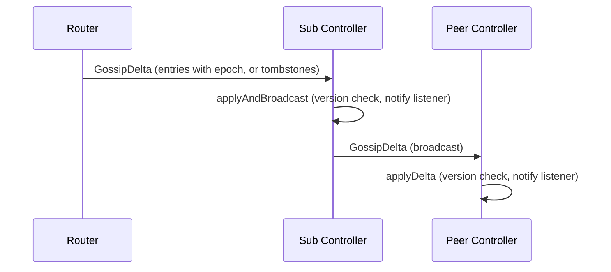
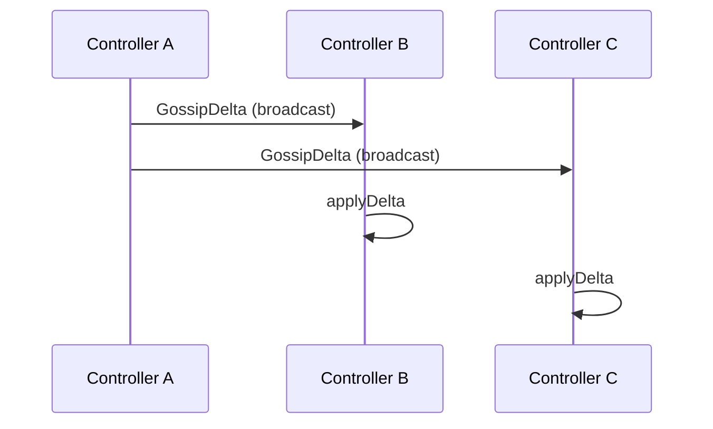
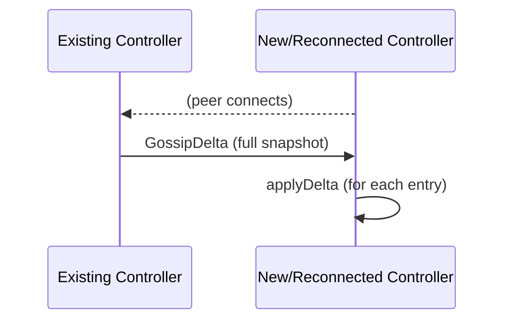
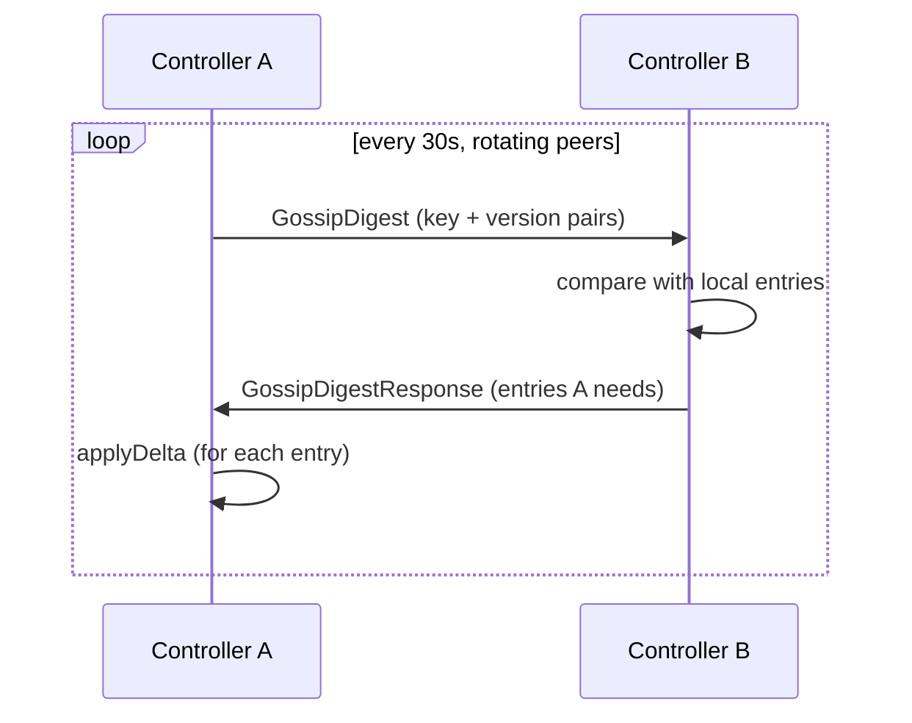
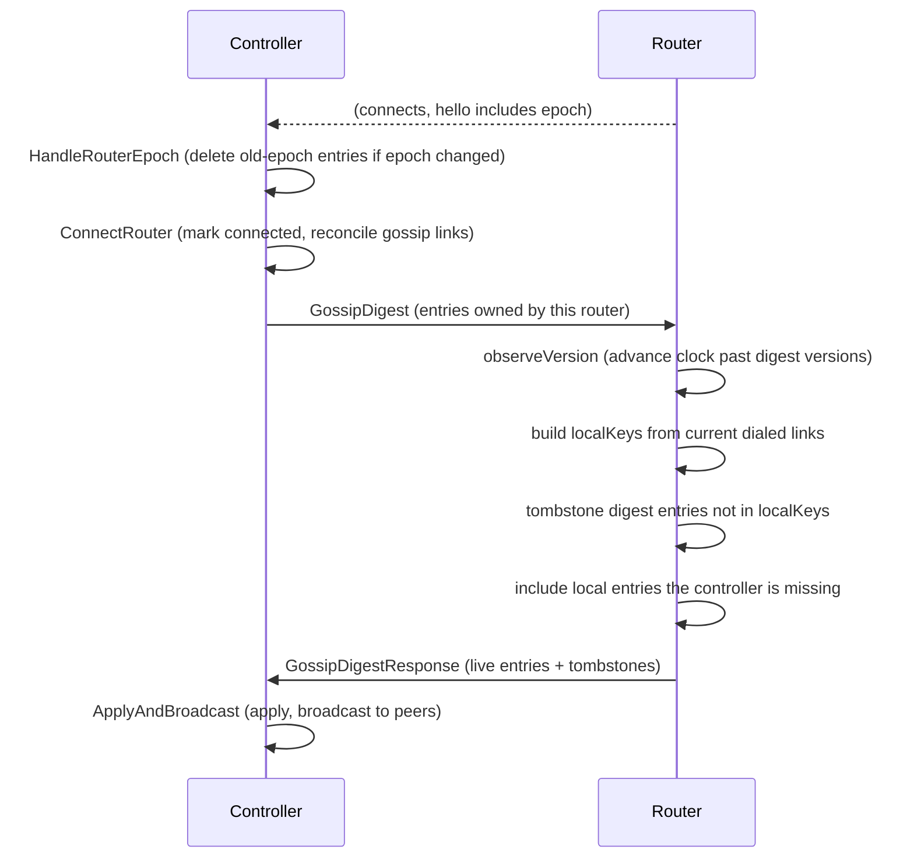
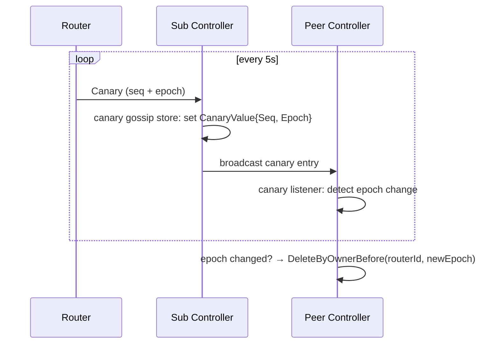
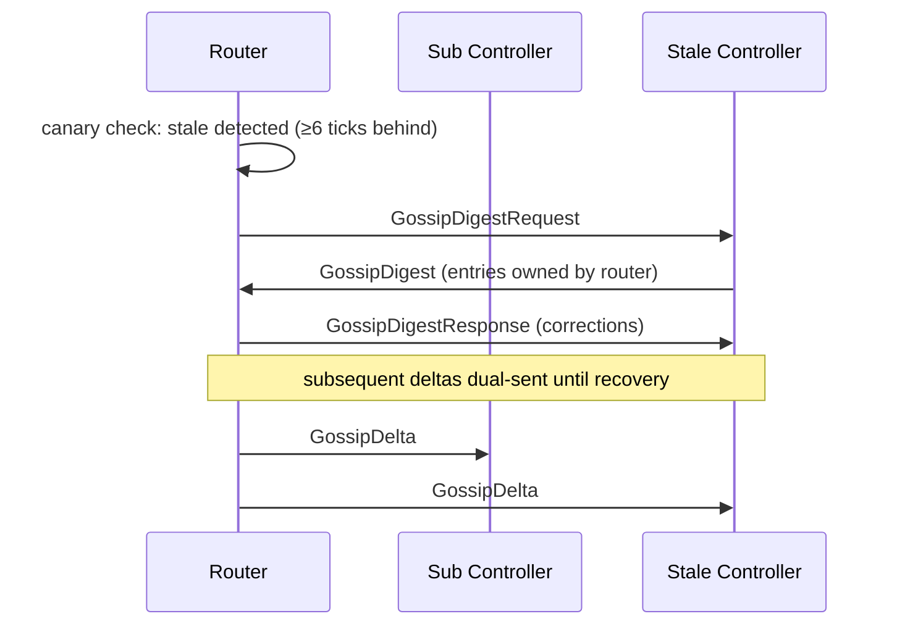
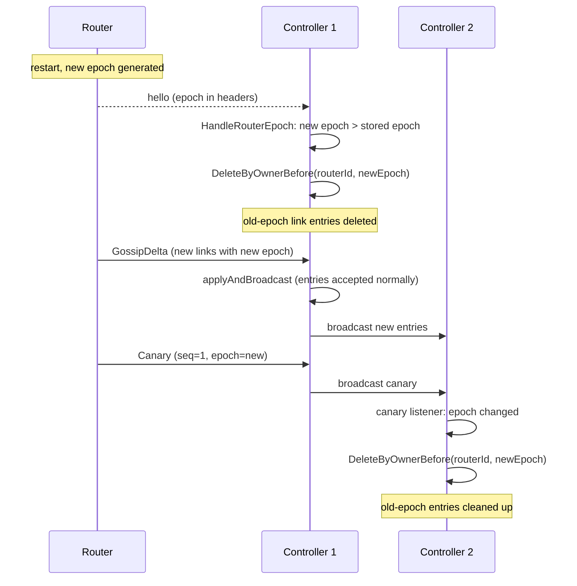
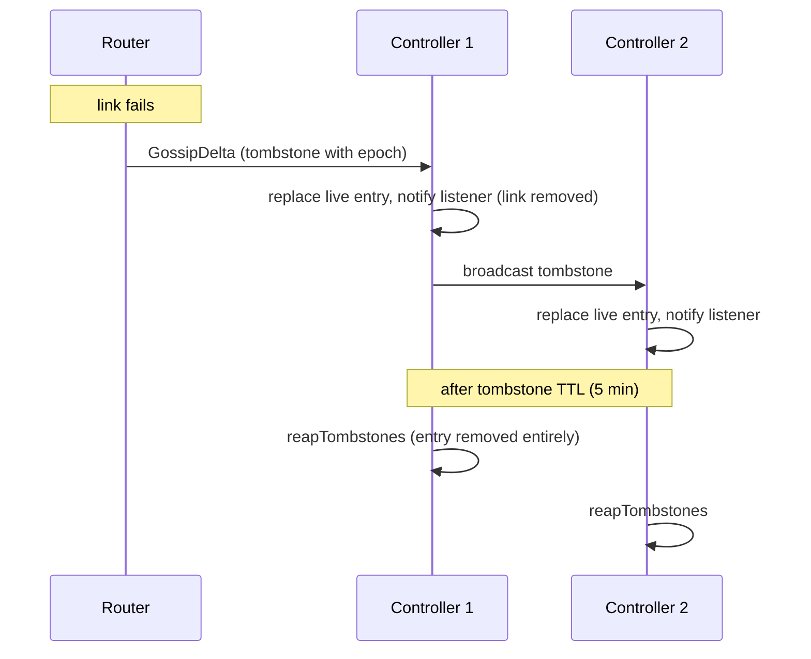

# Link Gossip Sequences

Sequence diagrams for the gossip flows described in [gossip.md](gossip.md).

## Participants

- **Router**: runs the `gossipClient`, dials links, sends gossip deltas and
  canaries
- **Subscription Controller (Sub)**: the controller a router sends gossip to
  (preferred: leader, fallback: most responsive)
- **Peer Controllers**: other controllers in the HA cluster

## 1. Router → Controllers: Link State Delta

Router establishes or faults a link, sends a gossip delta (with epoch) to the
subscription controller. The controller applies it and broadcasts to peers.

`NotifyLinks()` and `NotifyLinkFault()` both flow through `sendDelta()`. If
the send fails, `NotifyLinks` leaves the link as un-notified for retry;
`NotifyLinkFault` falls back to the pending fault queue.

After sending to the subscription controller, both also call
`sendToStaleControllers()` to dual-send to any controllers detected as behind
via the canary protocol.

## 2. Controller → Controller: Broadcast

Fire-and-forget. Applied entries are broadcast to all peers via the raft mesh.
If a peer is disconnected, it misses the broadcast. Anti-entropy and
peer-connect snapshots handle recovery.

## 3. Controller → Controller: Peer Connect Snapshot

When a peer joins or reconnects, the existing controller sends a full snapshot
of all entries (including tombstones). This bootstraps the new peer immediately
rather than waiting for anti-entropy.

## 4. Controller → Controller: Anti-Entropy

Every 30 seconds, each controller sends a digest to a rotating peer. The peer
responds with entries the sender is missing or has stale.

The digest only contains entries currently in the store. Reaped tombstones
disappear from the digest.

## 5. Router Reconnect: Digest Exchange

When a router connects, the controller sends a digest of entries owned by that
router. The router compares with its current links and responds.

The `observeVersion` call ensures tombstones have higher versions than old
entries, even after a restart resets the Lamport clock.

## 6. Canary and Epoch Distribution

The canary carries both the sequence number (for lag detection) and the epoch
(for restart detection). It flows through the canary gossip store, which has no
tombstones and no anti-entropy.

## 7. Stale Controller Detection and Dual-Send

The router's gossip refresher runs every 15 seconds, comparing canary sequences
across controllers. It also detects subscription controller changes.

If the subscription controller changes (leader election, reconnect), the
refresher detects it and sends a `GossipDigestRequest` to the new primary.

## 8. Router Restart: Epoch Change

The epoch mechanism cleanly handles router restarts without relying on
tombstones for old entries.

New-epoch entries that arrive at C2 before the canary are safe. The deletion
predicate (`entry.Epoch < newEpoch`) skips entries from the current epoch.

## 9. Tombstone Lifecycle

Within an epoch, link faults are handled by tombstones.

Tombstone resurrection (where a reaped tombstone allows a stale entry to return
via anti-entropy) is mitigated by the epoch mechanism. Cross-epoch stale
entries are cleaned up by the epoch change handler rather than relying on
tombstones.
