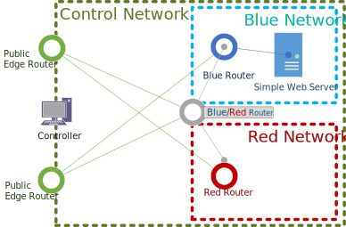

# Quickstart

This directory contains a set of scripts designed to make it easy to establish a starter overlay network.
The expectation is that these scripts and docker image are useful for learning or for establishing 
simple networks. As with any solution it is common for additional changes to the configuration to be required
after expanding beyond the initial setup.

There are three different modes contained in these folders. One mode allows you very quickly get setup and
run the two main components  of a OpenZiti network: ziti-controller and ziti-router. The [Express](#express)
configuration will guide you here.

The remaining two modes all use [docker](https://docs.docker.com/get-started/) to establish environments.
The first of the docker-based quickstarts uses [docker-compose](https://docs.docker.com/compose/). 
You will find a fully defined OpenZiti Network in a compose file which should allow you to understand better
and learn how multiple routers can be linked to form a mesh network or serve as an initial
template to build your own compose file from.

Lastly, you can choose to run [docker](https://docs.docker.com/get-started/) directly. This mode is necessarily
more verbose but should you prefer to not use docker-compose it can also illustrate how to establish
a OpenZiti Network piece by piece.

## Prerequisites

### Bash

All of these quickstarts will use bash. On MacOS/linux this will be natural however on Windows you'll want
to ensure you have a suitable shell. There are numerous shells available but perhaps the simplest will be
to use [Windows Subsystem for Linux (WSL)](https://docs.microsoft.com/en-us/windows/wsl/install-win10). You 
might also use git-bash, cygwin, or any other bash shell you fancy.

### Docker/Docker Compose

If you are interested in using the quickstarts which use docker/docker-compose you will clearly need to
have one or both installed and be moderately familiar with whichever you are using.

### Review All Scripts

Remember - it's always a good idea to review any scripts before you run them. We encourage you to review
the scripts in these folders before running them.

## Express

By far the easiest way to establish an environment quickly is to simply run the express install script
found at [./quickstart/docker/image/ziti-cli-functions.sh]().

### What It Does

The express install script will do quite a few things to get you bootstrapped.  It will:

1. create a full suite of configuration files located by default at ~/.ziti/quickstart/$(hostname)
    1. create a full suite of PKI
    1. create a config file for the controller
    1. create a config file for an edge router
1. download the latest distribution of ziti from github.com/openziti/ziti/releases
1. unzip the distribution
1. start the `ziti-controller` and `ziti-router` executables
1. the `ziti-controller` should now be exposed on https://$(hostname):1280

## Docker - Compose

The [docker-compose](https://docs.docker.com/compose/) based example will create numerous `ziti-router`s 
as well as spooling up a `ziti-controller` and expose the controller on port 1280. This configuration is intended to
look and feel like the following image:

Here, a simple OpenZiti Network is shown which contains two public OpenZiti Edge Routers, one router without the "edge" enabled
and usable only for transit, and two private edge routers: one blue, one red. The goal with this setup is to attempt to
have a single isolated service that is not accessible from outside of the blue network (as best as possible with 
only docker).

## Docker - No Compose

You can still startup a dev environment easily with [docker](https://docs.docker.com/get-started/) only. In this example
you will start a OpenZiti Controller as well as a single OpenZiti Edge Router.

### Prerequisite

Since the openziti project is all about creating overlay networks - it's important for the docker containers to be
able to communicate to one another. This is accomplished using a docker network and setting the alias of the container
on that docker network.

Before running the commands below please do the following:
  
      #declare a variable that defines the 'network'
      zitinw="myZitiNetwork"
      
      #declare a fully qualified path to the location you want your shared files to go and create it
      zitinw_shared="${HOME}/.ziti/dockerenvs/${zitinw}"
      mkdir -p "${zitinw_shared}"

      #make a docker network for isolation while allowing the parts to be able to interact
      docker network create "$zitinw"

### Starting the Containers

To start the containers you can simply run these two commands in two different shells. (or choose to daemonize them
once you're ready to do so). Take special note of the initial variables used in these commands. The ${zitinw} variable
is expected to be set. See the Prerequisite section above:

OpenZiti Controller:

    docker run -d --name "${zitinw}-controller" --volume "${zitinw_shared}":/openziti/shared -it --network="${zitinw}" --network-alias=ziti-controller --network-alias=ziti-edge-controller --rm openziti/quickstart /openziti/scripts/run-controller.sh

OpenZiti Edge Router:

    routerName=edge-router; docker run -d --name "${zitinw}-${routerName}" --rm -e ZITI_ROUTER_NAME="${routerName}" --volume "${zitinw_shared}":/openziti/shared -it --network="${zitinw}" --hostname "${routerName}" --network-alias="${routerName}" --rm openziti/quickstart /openziti/scripts/run-router.sh edge

## Releasing a new version of the Quickstart

### Artifacts Produced by a Release

The enclosing project's GitHub releases are never updated and no Git tags are created for a quickstart release.

1. `openziti/quickstart` container image [in Docker Hub](https://hub.docker.com/r/openziti/quickstart)
1. a CloudFront Function in AWS pointing the `get.openziti.io` reverse proxy to the GitHub SHA of the release

### Release Process

A quickstart release is created when either of the following conditions are met:

1. OpenZiti, the enclosing project, is released by the OpenZiti team
1. A pull request is merged into the trunk branch `release-next` with the label `quickstartrelease`

### Release Machinery

The release process is encoded in [a GitHub workflow](../.github/workflows/release-quickstart.yml).

### GitHub Raw Reverse Proxy

The `get.openziti.io` reverse proxy is a CloudFront distribution that points to a CloudFront Function and serves as a
shorter HTTP URL getter for raw GitHub source files, e.g. `https://get.openziti.io/dock/simplified-docker-compose.yml`.
The CloudFront Function is a JavaScript function that looks at the URI path of the incoming request and forwards it to
the appropriate GitHub raw download path. The CloudFront Function is updated by the release process, and the CloudFront
Distribution itself is hand-maintained in the AWS Console. The Distribution has these characteristics:

* Viewer Domain Name: `get.openziti.io` (frontend)
* Route Origin: `raw.githubusercontent.com` (backend, upstream)
* Auto-renewing TLS certificate from ACM
* Cache Policy `CachingOptimized` (default)
* Routes to Origin based on Javascript Function deployed by quickstart release

You can add or change a GitHub raw shortcut route by modifying the [routes.yml](../dist/cloudfront/get.openziti.io/routes.yml) file.
