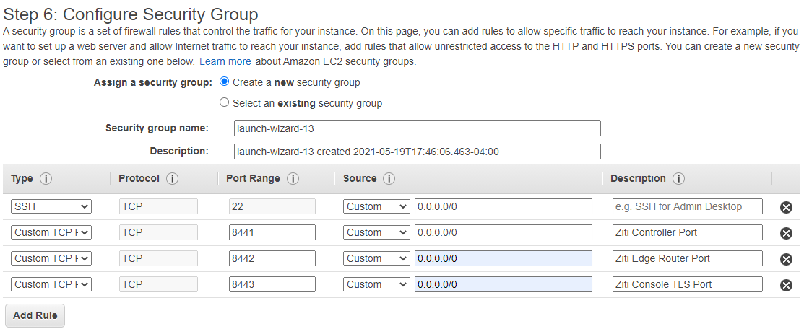
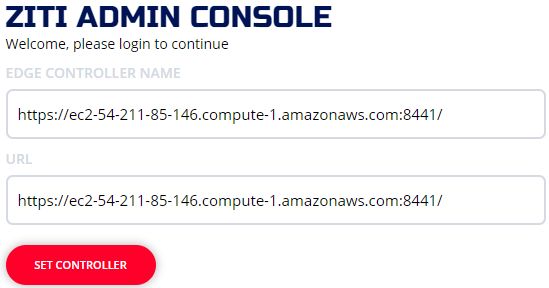
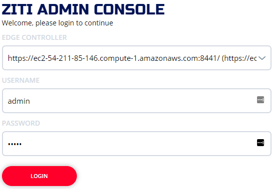
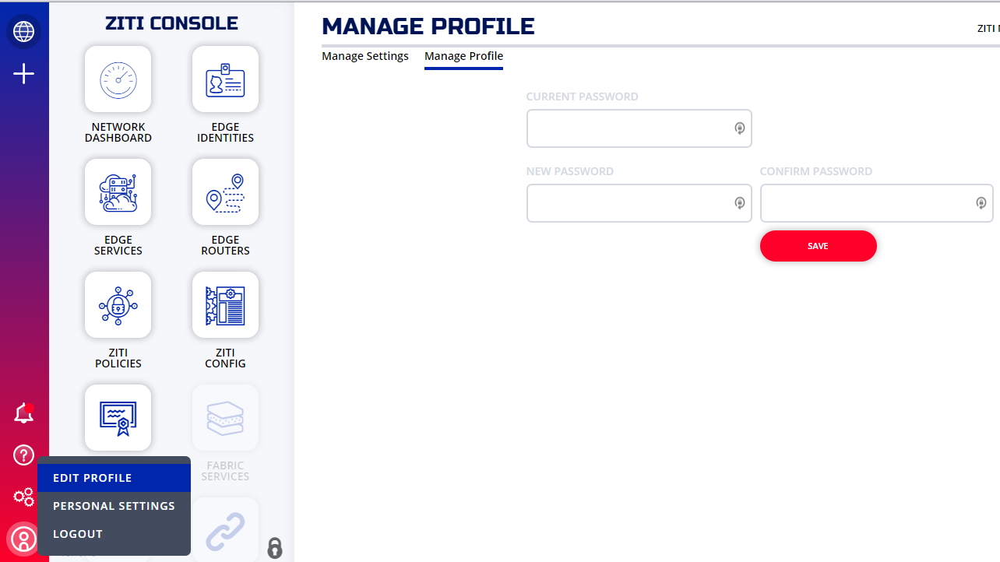

# Quickstart - AWS

This quickstart is a barebones guide to running a full developer environment in AWS. It is not fault-tolerant. If you require fault tolerance this guide is not for you. This guide also assumes you're at least familiar with AWS's console and cloud development. Feel free to replace any steps along the way you desire but these steps were tested at least a few times and hopefully whenever you're reading this, the steps are still valid. If not file an issue or shoot over to [Discourse](https://openziti.discourse.group/) and start a discussion.

## Setup a Server

1. After logging into AWS, navigate to the EC2 Dashboard
1. From the EC2 Dashboard, click "Launch Instance"
1. Find "Ubuntu Server 20.04 LTS (HVM), SSD Volume Type" and click 'select'
1. At the bottom of the screen - click the "Review and Launch" button
1. In AWS "Step 7. Review Instance Launch", find the "Security Groups" row and expand it if necessary
1. Click "Edit security groups"
1. Click "Add Rule" and select "Custom TCP Rule" and enter Port Range:"8441" Source: "0.0.0.0/0", Description: "Ziti Controller Port"
1. Click "Add Rule" and select "Custom TCP Rule" and enter Port Range:"8442" Source: "0.0.0.0/0", Description: "Ziti Edge Router Port"
1. Click "Add Rule" and select "Custom TCP Rule" and enter Port Range:"8443" Source: "0.0.0.0/0", Description: "Ziti Console TLS Port"
1. Your console should look like this:
   

1. click "Review and Launch" and then "Launch"
1. Select your keypair and choose "Launch Instances"

## SSH to the Server

1. After ssh'ing to the new ubuntu machine - run: `sudo apt update && sudo apt install jq -y`
1. Set some environment variables which are used to establish a PKI as well as the necessary configuration files. You will need to know the public IPv4 DNS name assigned to this machine. Replace "____EXTERNAL___DNS____" with the proper values. (**IMPORTANT** make sure the name is correct):

       export EXTERNAL_DNS="____EXTERNAL___DNS______FILLIN example: ec2-3-129-206-186.us-east-2.compute.amazonaws.com"

       export EXTERNAL_IP="$(curl -s eth0.me)"       
       export ZITI_EDGE_CONTROLLER_IP_OVERRIDE="${EXTERNAL_IP}"
       export ZITI_EDGE_ROUTER_IP_OVERRIDE="${EXTERNAL_IP}"
       export ZITI_EDGE_CONTROLLER_HOSTNAME="${EXTERNAL_DNS}"
       export ZITI_EDGE_ROUTER_HOSTNAME="${EXTERNAL_DNS}"
       export ZITI_EDGE_CONTROLLER_PORT=8441
       export ZITI_EDGE_ROUTER_PORT=8442
   
1. Run this single command to download and bootstrap the ziti-controller and ziti-router (feel free to read the bash script before running if you like):

       source <(wget -qO- https://raw.githubusercontent.com/openziti/ziti/release-next/quickstart/docker/image/ziti-cli-functions.sh); expressInstall

1. At this point the controller and router are running and can be accessed from anywhere. Confirm both are running by running:

       ps -ef | grep ziti
       root        2520       1  0 May19 ?        00:00:15 /home/ubuntu/.ziti/quickstart/ip-172-31-22-212/ziti-bin/ziti-v0.20.2/ziti-controller run /home/ubuntu/.ziti/quickstart/ip-172-31-22-212/controller.yaml
       root        2547       1  0 May19 ?        00:00:10 /home/ubuntu/.ziti/quickstart/ip-172-31-22-212/ziti-bin/ziti-v0.20.2/ziti-router run /home/ubuntu/.ziti/quickstart/ip-172-31-22-212/ip-172-31-22-212-edge-router.yaml
       
1. You can also issue this statement from the server and you will see a similar response to this:
   
       curl -sk "https://${ZITI_EDGE_CONTROLLER_HOSTNAME}:${ZITI_EDGE_CONTROLLER_PORT}/version"
       {"data":{"apiVersions":{"edge":{"v1":{"path":"/edge/v1"}}},"buildDate":"2021-05-05 20:59:40","revision":"73dd1db42bf4","runtimeVersion":"go1.16.3","version":"v0.19.13"},"meta":{}}

## Setting up Ziti Controller and Router as a service

1. Stop ziti-controller and ziti-router if they are running:

       killall ziti-controller ziti-router
1. copy the two systemd files and refresh systemd

       sudo cp "${ZITI_HOME}/ziti-controller.service" /etc/systemd/system
       sudo cp "${ZITI_HOME}/ziti-router-${ZITI_EDGE_ROUTER_RAWNAME}.service" /etc/systemd/system/ziti-router.service
       sudo systemctl daemon-reload
       sudo systemctl start ziti-controller
       sudo systemctl start ziti-router
1. Allow 5 to 10 seconds for the ziti-controller and router to start completely. Run these two commands to verify ziti-controller and ziti-router are running:

       sudo systemctl -q status ziti-controller --lines=0 --no-pager
       sudo systemctl -q status ziti-router --lines=0 --no-pager

       #sample output:
       ubuntu@ip-172-31-22-212:~$ sudo systemctl -q status ziti-controller --lines=0 --no-pager
       ● ziti-controller.service - Ziti-Controller
       Loaded: loaded (/etc/systemd/system/ziti-controller.service; disabled; vendor preset: enabled)
       Active: active (running) since Thu 2021-05-20 11:24:40 UTC; 5min ago
       Main PID: 26848 (ziti-controller)
       Tasks: 7 (limit: 1160)
       Memory: 50.5M
       CGroup: /system.slice/ziti-controller.service
       └─26848 /home/ubuntu/.ziti/quickstart/ip-172-31-22-212/ziti-bin/ziti-v0.20.2/ziti-controller run /home/ubu…
       
       ubuntu@ip-172-31-22-212:~$ sudo systemctl -q status ziti-router --lines=0 --no-pager
       ● ziti-router.service - Ziti-Router for ip-172-31-22-212-edge-router
       Loaded: loaded (/etc/systemd/system/ziti-router.service; disabled; vendor preset: enabled)
       Active: active (running) since Thu 2021-05-20 11:24:42 UTC; 5min ago
       Main PID: 26864 (ziti-router)
       Tasks: 7 (limit: 1160)
       Memory: 28.4M
       CGroup: /system.slice/ziti-router.service
       └─26864 /home/ubuntu/.ziti/quickstart/ip-172-31-22-212/ziti-bin/ziti-v0.20.2/ziti-router run /home/ubuntu/…
       ubuntu@ip-172-31-22-212:~$

## Setting up the Ziti Admin Console

### By Cloning from Github

1. clone the ziti-console repo from github:
   
       git clone https://github.com/openziti/ziti-console.git "${ZITI_HOME}/ziti-console"
1. Install node and npm and get the server ready

       cd "${ZITI_HOME}/ziti-console"
       sudo apt install npm nodejs -y
       npm install
1. Use the ziti-controller certificates for the Ziti Console:

       ln -s "${ZITI_PKI}/${ZITI_EDGE_CONTROLLER_HOSTNAME}-intermediate/certs/${ZITI_EDGE_CONTROLLER_HOSTNAME}-server.chain.pem" "${ZITI_HOME}/ziti-console/server.chain.pem"
       ln -s "${ZITI_PKI}/${ZITI_EDGE_CONTROLLER_HOSTNAME}-intermediate/keys/${ZITI_EDGE_CONTROLLER_HOSTNAME}-server.key" "${ZITI_HOME}/ziti-console/server.key"
1. Emit the Ziti Console systemd file and update systemd to start the Ziti Console

       createZacSystemdFile
       sudo cp "${ZITI_HOME}/ziti-console.service" /etc/systemd/system
       sudo systemctl daemon-reload
       sudo systemctl start ziti-console
1. Verify the Ziti Console is running
       sudo systemctl status ziti-console --lines=0 --no-pager
   
       #sample output of the command:
       ubuntu@ip-172-31-22-212:~$ sudo systemctl status ziti-console --lines=0 --no-pager
       ● ziti-console.service - Ziti-Console
       Loaded: loaded (/etc/systemd/system/ziti-console.service; disabled; vendor preset: enabled)
       Active: active (running) since Wed 2021-05-19 22:04:44 UTC; 13h ago
       Main PID: 13458 (node)
       Tasks: 11 (limit: 1160)
       Memory: 33.4M
       CGroup: /system.slice/ziti-console.service
       └─13458 /usr/bin/node /home/ubuntu/.ziti/quickstart/ip-172-31-22-212/ziti-console/server.js

### By Using Docker

1. If needed, install docker on the machine. I followed these instructions https://linuxize.com/post/how-to-install-and-use-docker-on-ubuntu-20-04/ but we'll condense them here for you to copy/paste:

       sudo apt update
       sudo apt install apt-transport-https ca-certificates curl gnupg-agent software-properties-common -y
       curl -fsSL https://download.docker.com/linux/ubuntu/gpg | sudo apt-key add -
       sudo add-apt-repository "deb [arch=amd64] https://download.docker.com/linux/ubuntu $(lsb_release -cs) stable"
       sudo apt install docker-ce docker-ce-cli containerd.io -y
       sudo usermod -aG docker $USER
1. Log out of the server, and log back in to activate docker for your user
1. Copy/paste this command to start the Ziti Admin Console in TLS mode:

       docker run -d \
              --name zac \
              -p 8443:8443 \
              -v "${ZITI_PKI}/${ZITI_EDGE_CONTROLLER_HOSTNAME}-intermediate/keys/${ZITI_EDGE_CONTROLLER_HOSTNAME}-server.key":/usr/src/app/server.key \
              -v "${ZITI_PKI}/${ZITI_EDGE_CONTROLLER_HOSTNAME}-intermediate/certs/${ZITI_EDGE_CONTROLLER_HOSTNAME}-server.chain.pem":/usr/src/app/server.chain.pem \
              openziti/zac

## Login and use the Ziti Console
1. At this point you should be able to navigate to both: https://${ZITI_EDGE_CONTROLLER_HOSTNAME}:8443 as well as https://$(curl -s eth0.me):8443 and see the ZAC login screen. (The TLS warnings your browser will show you are normal - it's because these steps use a self-signed certificate generated in the install process)
1. Set the controller as shown:

   
1. Login with admin/admin

   

1. **IMPORTANT!!!** Edit your profile and change the password

   

## Adding Environment Variables Back to the Shell

If you log out and log back in again you can source the '.env' file located at: `. ~/.ziti/quickstart/$(hostname)/$(hostname).env`. Below is an example of logging in, not having ZITI_HOME set, sourcing the .env file and then showing ZITI_HOME set:

    Last login: Thu May 20 11:36:25 2021 from 67.246.244.61
    ubuntu@ip-172-31-22-212:~$ echo $ZITI_HOME
    
    ubuntu@ip-172-31-22-212:~$ . ~/.ziti/quickstart/$(hostname)/$(hostname).env
    
    adding /home/ubuntu/.ziti/quickstart/ip-172-31-22-212/ziti-bin/ziti-v0.20.2 to the path
    ubuntu@ip-172-31-22-212:~$ echo $ZITI_HOME
    /home/ubuntu/.ziti/quickstart/ip-172-31-22-212
