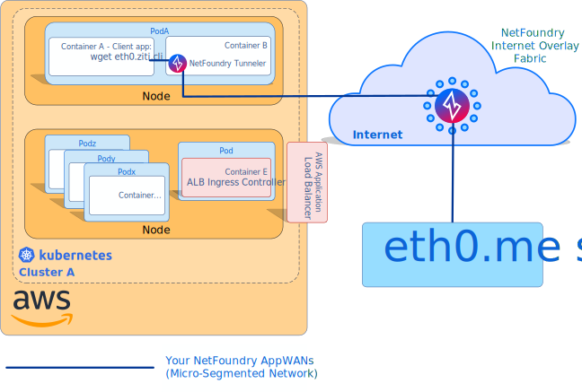

# Kubernetes Sidecar Client

This guide shows you how to access a Ziti service from a pre-existing (or third party) application that's running
in a Kubernetes Pod. To provide access to the service, we will deploy the `ziti-tunnel` client in a sidecar
container.

## Overview

The [Ziti Network Quickstart](https://openziti.github.io/ziti/quickstarts/networks-overview.html)
walked you through standing up a Ziti instance and accessing a Ziti service from your workstation with 
`ziti-tunnel`. In this guide we'll deploy the same `ziti-tunnel` client, but instead of running it from the
command line we will deploy it in a sidecar container in a Kubernetes Pod.

This guide also demonstrates `ziti-tunnel`'s internal DNS server, which allows us to access Ziti services
by hostname instead of IP address.

[Here's some detail on how the various intercept modes work on Linux](https://openziti.github.io/ziti/clients/linux.html)

### Solution Overview

## Prerequisites

- Complete the [Ziti Network Quickstart](https://openziti.github.io/ziti/quickstarts/networks-overview.html). This guide
  uses the Ziti Controller and Ziti Edge Router that are created in the Ziti Quickstart.
- Admin-level access to a Kubernetes cluster via `kubectl`.

## Create an Identity and AppWAN

This guide will re-use the "eth0.ziti.cli" service that was created in the Ziti Network Quickstart.

We will create a new identity for our client, with a new AppWAN that uses the eth0.ziti.cli service.

Create the Identity:

    ziti edge controller create identity device tunnel-sidecar -o tunnel-sidecar.jwt

Create the AppWAN and reference the service created in the Ziti Network Quickstart. We'll be using `eth0.ziti.cli`
here but if you created `eth0.ziti.ui` in the quickstart - use that instead. Also note that in the
tunnel-sidecar-demo.yaml:

    ziti edge controller create app-wan ziti-tunnel-appwan -i tunnel-sidecar -s eth0.ziti.cli

## Create a Kubernetes Secret

The `ziti-tunnel` sidecar will access its identity by mounting a Kubernetes secret in the container.
We can mount the JWT as a secret like this:

    $ kubectl create secret generic tunnel-sidecar.jwt --from-file=tunnel-sidecar.jwt
    secret/tunnel-sidecar.jwt created

## Deploy the Pod

Deploy a Pod that runs a client application and `ziti-tunnel` as a sidecar container. For this
demonstration, the client application is `curl`. Our Pod runs `curl` in a loop so we can see content
from our Ziti service in the Pod's logs.

Save the following yaml to a file named tunnel-sidecar-demo.yaml

    apiVersion: v1
    kind: PersistentVolumeClaim
    metadata:
      name: tunnel-sidecar-pv-claim
    spec:
      accessModes:
        - ReadWriteOnce
      resources:
        requests:
          storage: 100Mi
    ---
    apiVersion: apps/v1
    kind: Deployment
    metadata:
      name: ziti-tunnel-sidecar-demo
    spec:
      replicas: 1
      selector:
        matchLabels:
          app: ziti-tunnel-sidecar-demo
      strategy:
        type: Recreate
      template:
        metadata:
          labels:
            app: ziti-tunnel-sidecar-demo
        spec:
          containers:
          - image: centos
            name: testclient
            command: ["sh","-c","while true; set -x; do curl -sSLf eth0.ziti.cli 2>&1; set +x; sleep 5; done"]
          - image: netfoundry/ziti-tunnel:latest
            name: ziti-tunnel
            env:
            - name: NF_REG_NAME
              value: tunnel-sidecar
            volumeMounts:
            - name: tunnel-sidecar-jwt
              mountPath: "/var/run/secrets/kubernetes.io/enrollment-token"
              readOnly: true
            - name: ziti-tunnel-persistent-storage
              mountPath: /netfoundry
            securityContext:
              capabilities:
                add:
                - NET_ADMIN
          dnsPolicy: "None"
          dnsConfig:
            nameservers:
              - 127.0.0.1
              - 8.8.8.8
          restartPolicy: Always
          volumes:
          - name: ziti-tunnel-persistent-storage
            persistentVolumeClaim:
              claimName: tunnel-sidecar-pv-claim
          - name: tunnel-sidecar-jwt
            secret:
              secretName: tunnel-sidecar.jwt

You'll notice that the `ziti-tunnel` sidecar container has a few requirements:

1. The name of the identity that is assumed by `ziti-tunnel` must be passed into the container with the
   `NF_REG_NAME` environment variable.
2. The secret that we created above for the enrollment token must be mounted into the container at
   "/var/run/secrets/netfoundry.io/enrollment-token".
3. A persistent volume must be mounted at "/netfoundry". This volume is used to save the json file that is created
   when the one-time enrollment token is used. If this volume is not persistent, you will need to provide a new
   enrollment token each time the Pod is restarted!

Once the yaml is saved, we can deploy the Pod with `kubectl`

    $ kubectl apply -f ./tunnel-sidecar-demo.yaml
    persistentvolumeclaim/tunnel-sidecar-pv-claim created
    deployment.apps/ziti-tunnel-sidecar-demo created

## Test the Service

First we need to get the name of the Pod that Kubernetes deployed for us:

    $ kubectl get pods
    ziti-tunnel-sidecar-demo-749c476989-6wpfn   1/1     Running   0          42s

Then we can tail the logs for the "testclient" container:

    $ kubectl logs -f ziti-tunnel-sidecar-demo-749c476989-6wpfn --container testclient
    54.67.121.213
    54.67.121.213
    54.67.121.213

Notice that the `curl` client is using the DNS name that we provided in the Ziti service definition to make the
request.
